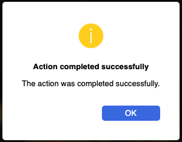
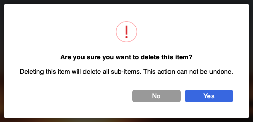

# jsDialogs
## Description
A javascript module to show custom html in-page dialog boxes.
## Usage
### HTML
The html should have a DIV with the id `modalDialogShade`:
```HTML
<div id="modalDialogShade">
</div>
```

Typically, this will right before the closing `</body>` tag, followed with the `<script src='js/dialogs.js'></script>`

### CSS
A sample CSS is included, modify as you wish.

The only thing to note is that the `display` property of the `modalDialogShade` is switched between `none` and `flex` in the javaScript code. It should initially be set to `none`.

### JavaScript
Include the js file:
```HTML
<script src="js/dialogs.js" charset="utf-8"></script>
```

Whenever you need a dialog, you call: `showDialog`:
```JavaScript
showDialog(headerText, contentText [, icon [, buttons]])
```
*Returns* `true` if successful, or `false` with a debug error message, if failed.

*Where*
- `headerText`
 - String
  - The main text of the dialog box

- `contentText`
 - String
   - The sub-text, or explaination text

- `icon`
 - int (optional)
    - the icon to be shown: `0-Stop`, `1-Caution`, `2-Alert/Note`
    - default: `2-Alert/Note`

- `buttons`
 - JSON (optional)
   - JSON array holding the description of the buttons, and their action function
for each button:
      - `label`
        - String
        - Button label text
      - `action`
        - function (optional)
        - the function to be called when the button is clicked
        - default: `hideDialog`
     - `default`
       - boolean (optional)
       - whether this button is to be styled as default or not
       - default: `false`
  - If not provided, defaults to an `OK` button, with the default action of `hideDialog`.

## Examples
### Example 1
To create a dialog informing the user of the completion of an action, with just an OK button.
```JavaScript
showDialog('Action completed successfully', 'The action was completed successfully.', 1);
```



### Example 2
To create a dialog asking the used whether they really want to delete an item, assuming that deleting the item will call a function `deleteItem()`:

```JavaScript
sucess = showDialog('Are you sure you want to delete this item?', 'Deleting this item will delete all sub-items. This action can not be undone.', 0, [{'label':'Yes', 'default':true, 'action': deleteItem}, {'label':'No'}]);
```


